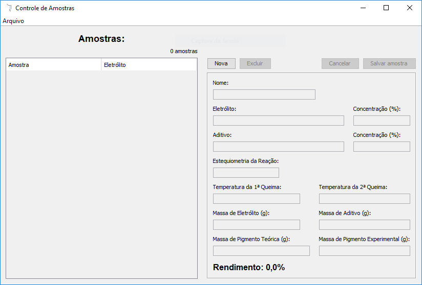

<h1>Controle de amostras</h1>

Programa Desktop criado para auxiliar químicos no controle das informações referêntes as amostras de suas sinteses.

 
<h2>Descrição</h2>

O programa guarda uma lista com as informações de cada sitese realizada. Sendo possível salvar essa lista em um arquivo e carregar uma lista de um arquivo.

São realizados altomáticamente o cálculo de porcentagem (%) de rendimento,  a verificação das concentrações de cada elemento presente na amostra e a verificação da massa final da amostra em relação a massa teórica prevista.

  

 
<h2>Instalação</h2>

O programa pode ser executado em todos os sistemas operacionais, mas é necessário ter o <a target="_blank" href="https://www.java.com/pt_BR/download/">Java JRE</a> ou <a target="_blank" href="http://www.oracle.com/technetwork/pt/java/javase/downloads/index.html">Java JDK</a> instalado em seu computador.

<h3>Instalação Windows</h3>

O programa conta com um instalador automátizado para computadores Windows, basta executar o instalador que ele irá criar todas as pastas e arquivos necessários para execução do programa:

<ol>
    <li>
    Caso não possua uma versão do Java instalado em seu computador baixe e instale o <a target="_blank" href="https://www.java.com/pt_BR/download/">Java JRE</a> ou o <a target="_blank" href="http://www.oracle.com/technetwork/pt/java/javase/downloads/index.html">Java JDK</a>.
    </li>
    <li>
    Baixe e instale o arquivo <a href="https://raw.githubusercontent.com/jonatastbelotti/controleAmostras/master/setup_controle_amostras.exe">setup_controle_amostras.exe</a>.
    </li>
</ol>

<h3>Instalação Linux</h3>

O Programa não conta com um instalador para Linux, sendo disponibilizado o arquivo JAR para execução direta:

<ol>
    <li>
    Caso não possua uma versão do Java instalado em seu computador baixe e instale o <a target="_blank" href="https://www.java.com/pt_BR/download/">Java JRE</a> ou o <a target="_blank" href="http://www.oracle.com/technetwork/pt/java/javase/downloads/index.html">Java JDK</a>.
    </li>
    <li>
    Baixe e execute o arquivo JAR <a href="https://raw.githubusercontent.com/jonatastbelotti/controleAmostras/master/controleAmostras.jar">controleAmostras.jar</a>.
    </li>
</ol>

<h3>Instalação Mac</h3>

Assim como para computadores Linux, o programa não conta com um instalador para computadores Mac, sendo disponibilizado o arquivo JAR para execução direta:

<ol>
    <li>
    Caso não possua uma versão do Java instalado em seu computador baixe e instale o <a target="_blank" href="https://www.java.com/pt_BR/download/">Java JRE</a> ou o <a target="_blank" href="http://www.oracle.com/technetwork/pt/java/javase/downloads/index.html">Java JDK</a>.
    </li>
    <li>
    Baixe e execute o arquivo JAR <a href="https://raw.githubusercontent.com/jonatastbelotti/controleAmostras/master/controleAmostras.jar">controleAmostras.jar</a>.
    </li>
</ol>

 
<h2>Suporte e direitos</h2>

Esse programa foi inteiramente desenvolvido por Jônatas Trabuco Belotti, sendo disponibilizado de maneira gratuita todo o código fonte para qualquer um que queira usá-lo ou modificá-lo. Para entrar em contato com o desenvolvedor envie um e-mail para <a href="mailto:jonatas.t.belotti@hotmail.com">jonatas.t.belotti@hotmail.com</a>.
